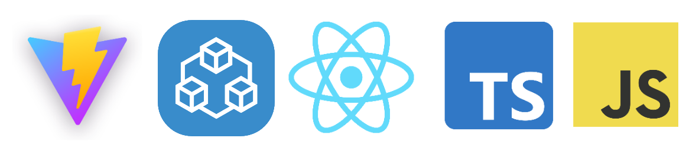

# React + TypeScript + JavaScript + tRPC + Vite

This example how to start tRPC with TypeScript and JavaScript with React syntax sugar (jsx and tsx)

## Full stack:

## Start it
1) Install packages in services and package 
    
with npm

    <code>
    $ npm i
    </code>
    
with yarn:

    <code>
    $ yarn
    </code>
2) Start server and client and admin
   
yarn command:

   <code>$ yarn dev</code>
   
npm command:

   <code>$ npm run dev</code>